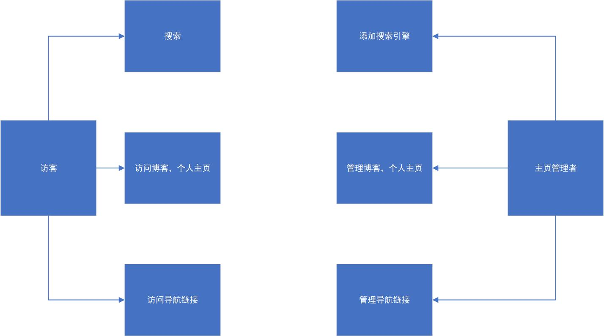
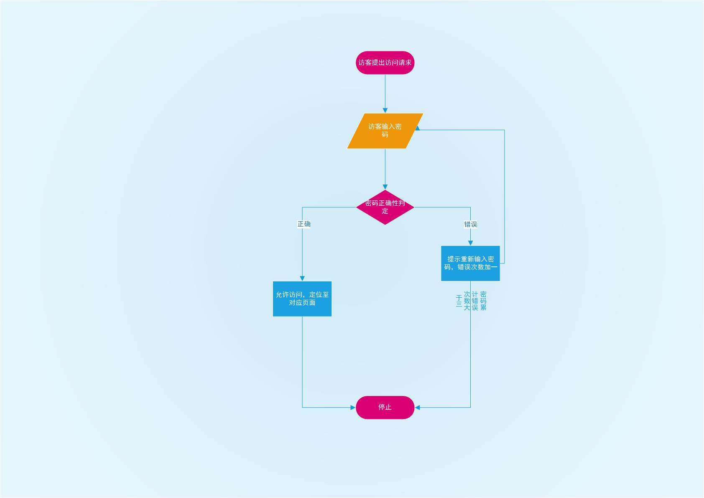

关于建立个人导航页的可行性分析与需求分析

191098235 王昱凯

# 1. 引言
## 1.1 报告撰写目的
个人导航页是一种集合了个人常用的网站访问需求与个人信息展示需求为一体的功能性网站。此可行性分析报告旨在分析再短时间内实现个人导航网站搭建的可行性，从而进一步确定个人导航页开发的流程步骤。

## 1.2 项目背景
对于在校大学生而言，一方面每个人都有自己浏览网页的偏好，另一方面学校有许多网站需要我们去关注。一个好的导航主页可以大大提升我们的工作学习效率。
***
# 2. 可行性分析
## 2.1.1 采用架构
本项目采用浏览器架构:浏览器可用microsoft edge(采用chromium内核)或其他等同浏览器。
## 2.1.2 主要功能要求
主要分为三大模块功能：网页搜索，网页导航，个人简历页和博客页导航
(1)网页搜索主要包括的功能：直接在搜索框中进行搜索，更换搜索引擎，前往搜索引擎首页等等
(2)网页导航主要包括的功能：导航至特定网站，添加/删除特定的网站导航
(3)个人简历页和博客页导航：导航至个人的简历网页以及博客园个人博客页

# 2.2 系统开发要求
## 2.2.1 网站实现
开发周期： 文档编写1周，代码编写1周，网页测试1周
## 2.2.2 环境搭建
域名和解析规则均采用阿里云万网，代码开发环境采用vscode,代码调试环境采用microsoft edge浏览器。
## 2.2.3 费用开支与效益分析
(1) 租用域名0.75元/月，环境搭建采用免费开源软件;
(2) 代码开发，因项目为个人导航主页，所需开发与维护人员为1；
综上所述，各项费用开支基本为0，个人导航主页为非盈利的网站，纯经济效益为0

# 2.3 其他各因素的可行性分析
## 2.3.1 可用性方面分析
搭建符合本人网页浏览习惯和个人展示需求的导航主页，且可以用于日常浏览器的启动页，可用性较佳。
## 2.3.2 法律方面分析
导航和搜索功能都只是对相关资源的重定向或采用开源项目，无版权风险；
简历和博客内容都是个人信息，有隐私泄露的风险，考虑采用密码保护。

## 2.3.3 可行性分析总结
上述可行性分析，参考现有开发资料，文档等资源，个人导航主页的开发模式比较完善，且有很多先例可行，对于个人开发而言要求较低，具备进一步进行需求分析和个人开发的条件。
***
以上为项目的可行性分析，自此向下为博客的需求分析
# 3. 项目功能需求
## 3.1 基本需求分析
基于个人导航页的特点，本网页实现个人导航页的各主要功能，包括个人账号的登录/退出，使用/修改搜索引擎，访问/修改导航模块，引导至个人博客和简历页等等。个人导航页主要区分了两类用户，分别是站主和游客

## 3.2 系统设计方法
(1)系统为导航页站主提供登录，登出界面，不为普通用户提供登录以及登录后的管理界面。
(2)普通用户仅有使用搜索引擎，更改搜索引擎，访问导航页等功能，不涉及对网页源代码的修改。
(3)站主可输入账号密码之后登录，登录后可进行修改页面布局等管理操作。

## 3.3功能性分析
(1)网页搜索功能
(2)修改主页背景
(3)访问快捷导航
(4)访问开发者的博客和github

# 4. 开发环境、硬件以及软件的要求
开发工具：vscode,microsoft edge,office visio 2019
编程语言：javascript,html,css
开发模式：浏览器模式
软件与硬件要求：
测试及运行设备：普通PC;
测试环境：windows 10;
浏览器内核：chromium版本89.0.774.63

# 5. 系统的结构化功能建模，分层数据流图
(1)顶层数据流图

(2)一层数据流图

(3)二层数据流图
i.用户搜索功能
ii.访问个人博客，主页
iii. 更改导航链接库

# 6. 数据字典描述
(1)顶层数据字典
(i)访客/游客：指除了主页开发者/管理者之外所有访问该网页的人。
数据流：搜索网页，访问导航链接，访问开发者博客和个人主页
(ii)主页开发者/管理者：指可以修改网页的底层元素的人
数据流：自定义网页外观，修改链接模块，修改搜索引擎库等
(2)一层数据字典
(i)网页搜索：
对应实体：访客，主页开发者
数据流：搜索
简述：调用开源搜索引擎实现全网搜索
(ii)访问导航链接
对应实体：访客，主页开发者
数据流：访问网页
简述：访问链接模块对应的网页
(iii)访问开发者个人主页
对应实体：访客
数据流：访问开发者个人主页，博客
简述：访问主页开发者的个人主页，博客
(iiii)修改主页
对应实体：主页开发者
数据流：修改主页底层代码
简述：更改主页的外观，链接模块，搜索引擎库等
(3)二层数据字典
(i)密码正确性检查
输入数据流：相关密码
输出数据流：密码正确性
加工逻辑：如果密码与开发者提供的密码不同，则无法访问
(ii)选择搜索引擎
输入数据流：访客选择的搜索引擎
输出数据流：搜索引擎可用性
加工逻辑：将访客选择的搜索引擎进行试搜索，检查搜索引擎的可用性

# 7. 系统行为建模，状态图示例
下面以用户访问开发者个人主页的行为作为示例：

# 8.数据库及E-R图
本网页不涉及数据库

THE END
