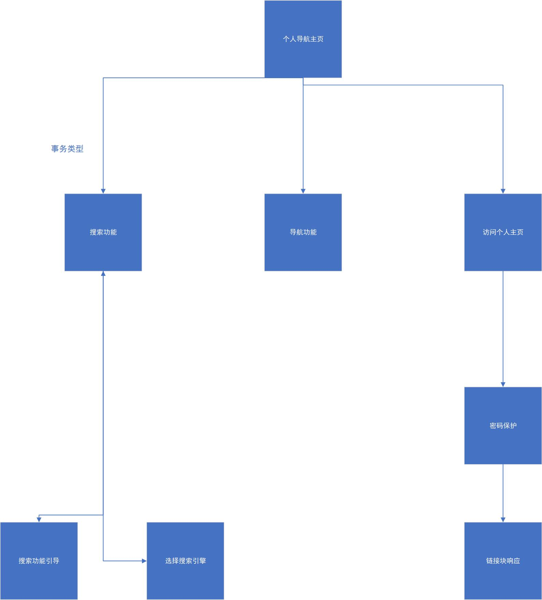
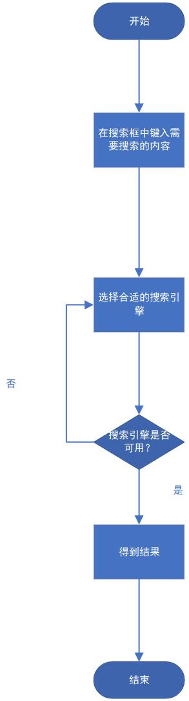
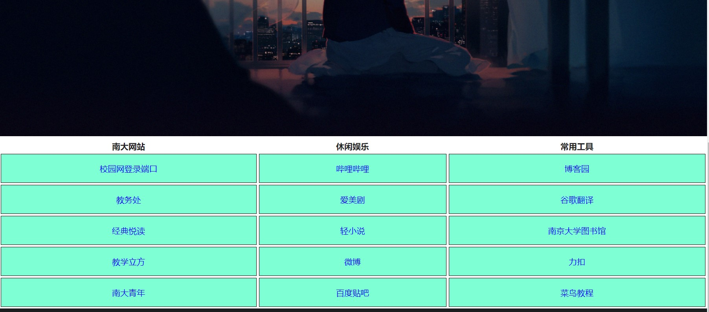
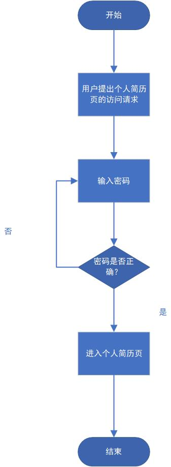
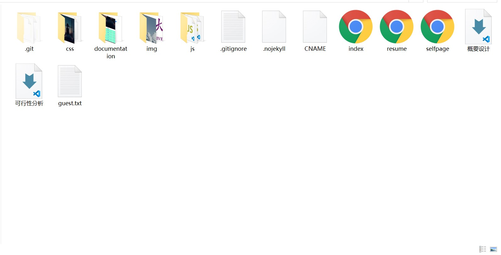

个人导航页――――概要分析和需求分析

191098235 王昱凯

## 一、体系结构设计
### 1. 软件结构化设计概述
该阶段主要在于定义个人导航页的主要结构元素与其之间的关系
详细的数据流图已在需求分析文档中给出，通过功能划分过程来完成软件结构设计，设计基本模块如下：搜索，访问快捷链接，访问个人主页。此外还有网页元素的功能响应等，

### 2. 结构化分析过程
i. 根据数据流图决定问题的类型 ： 变换型和事务型。针对两种类型分别进行分析处理
ii. 由数据流图推导出系统的初始结构图。
iii. 利用启发式原则来改进系统的初始结构图，得到符合要求的结构图。

### 3. 结构图

## 二、接口设计
### 1. 软件接口设计概述
依据数据流图中的自动化系统边界设计个人导航页与用户（网站开发者）之间的交互

### 2. 软件与用户之间交互的接口设计
以下用几个例子描述个人导航页的UI设计

i. 选择搜索引擎

ii. 访问个人主页

(这里主要做了一个个人网站的集成页面)

### 3. 模块与软件构件间的接口设计
模块间的接口主要是以操作响应的方式，包括：
1. 点击“我的个人主页站”按钮，跳出个人主页界面
2. 点击简历页，跳出密码认证
3. 点击对应的搜索引擎模块，调用对应的搜索引擎
   
信息传递主要体现在密码验证过程当中

### 4. 软件与其他软硬件系统之间的接口设计
个人导航页运行需要浏览器提供相应的运行环境，网站的编译和维护依赖远程服务器的支持

## 三、数据设计
### 1. 数据设计概述
本网页主要涉及的数据有：搜索引擎的url和搜索规则，各种网页的地址，个人通讯网站的地址等。详细的数据流图已在需求分析文档中给出。

### 2. 文件设计
#### i. 非结构化数据
网页运行中所设计的图片等用单独的文件夹存储，其余的如搜索引擎url等数据均保存在公共服务器上

#### ii. 非关系层次化数据，如系统配置文件
网页运行需要调用css,js等类型的配置文件，保存在js,css两个文件夹当中

## 四、过程设计
### 1. 详细设计阶段描述
确定个人导航页各个组成部分的编写逻辑，并采用流程图的方式进行各类操作响应逻辑的图示。

### 2. 流程图设计
我们选取了以下功能的响应逻辑示例，其余功能不再一一列出
i. 网页搜索功能

ii. 导航页

ii. 访问个人简历

密码功能会记录访客于guest.txt

